<div align="center">



<br/>

[](https://DenisNekrasov.dev)

<br/>

<a href="https://DenisNekrasov.dev"></a>
<a href="mailto:Denis@GNekrasov.ru"></a>
<a href="https://linkedin.com/in/denisnekrasov"></a>

<sub>🇷🇺 Русский &nbsp;·&nbsp; <a href="README_EN.md">🇬🇧 English</a></sub>

</div>

<br/>

## 💻 whoami

```bash
$ whoami
Денис Некрасов — Senior IT Specialist · 10+ лет в IT

$ cat mission.txt
Простые архитектуры · воспроизводимые окружения · метрики и SLO
Довожу решения до измеримого эффекта для бизнеса

$ history | tail -3
  Руководитель IT: инфраструктура с нуля, модернизация систем
  Мост между IT и бизнесом: переговоры, подрядчики, процессы
  Автоматизирую всё, что можно автоматизировать_
```

- 🔭 Работаю над **масштабируемыми инфраструктурными решениями**
- 🌱 Углубляюсь в **Kubernetes**, **Terraform** и **Cloud Native**
- 👯 Открыт к **collaboration** в open-source проектах
- 💬 Всегда готов обсудить **DevOps**, **Backend** и **архитектуру систем**
- 🌐 Проекты и кейсы — на [**DenisNekrasov.dev**](https://DenisNekrasov.dev)

<br/>

## ⚙️ Технологический стек

<table>
<tr>
<td align="right"><b>Инфраструктура<br/>& DevOps</b></td>
<td>


</td>
</tr>
<tr>
<td align="right"><b>Мониторинг<br/>& Observability</b></td>
<td>


</td>
</tr>
<tr>
<td align="right"><b>Базы данных<br/>& брокеры</b></td>
<td>


</td>
</tr>
<tr>
<td align="right"><b>Языки</b></td>
<td>


</td>
</tr>
<tr>
<td align="right"><b>Frontend</b></td>
<td>


</td>
</tr>
<tr>
<td align="right"><b>Интеграции</b></td>
<td>


</td>
</tr>
</table>

<br/>

## 🏆 Ключевые достижения

> 🥇 **Победа в конкурсе Global CIO** (вместе с Михаилом Кисленко) —
> [«Построение локального ИТ-ландшафта при отделении от международной компании»](https://globalcio.ru/projects/36374/)

- 🏗️ **IT-инфраструктура с нуля** для ГК «Ростовская Нива» — портовый и линейный элеваторы, мельница, колхоз
- ⚙️ **Автоматизация портового элеватора в Азове** — полный цикл работы предприятия, 1C, автоматизация в мельчайших деталях
- 🔄 **Переход элеватора на новую систему управления** при смене собственника — **без остановки работы**
- 🚀 **Отделение от международной компании** — независимый IT-ландшафт **за 3 месяца**
- 🚛 **Система управления движением зерновозов** полного цикла — распознавание номеров, автоматика шлагбаумов, интеграция лабораторных приборов

<br/>

## 🚀 Что я делаю

<table>
<tr>
<td width="33%" valign="top">

### 🏗️ Инфраструктура

CI/CD-пайплайны (GitHub Actions, GitLab CI, Jenkins) · High Availability и Disaster Recovery · Blue-Green и Canary деплой · Infrastructure as Code (Terraform, Ansible)

</td>
<td width="33%" valign="top">

### 🌐 Full Stack

Микросервисы и RESTful API · React / Vue + TypeScript · Интеграции (REST, GraphQL, Webhooks) · ETL и миграции данных · Real-time (WebSockets, SSE)

</td>
<td width="33%" valign="top">

### 📊 Наблюдаемость

Prometheus + Grafana дашборды · Централизованные логи (ELK, Loki) · Distributed tracing (Jaeger, OpenTelemetry) · SLO/SLI и алертинг

</td>
</tr>
</table>

<br/>

## 💼 Опыт работы

<details>
<summary><b>🏢 Louis Dreyfus (Азов)</b> — администрирование и интеграция IT-систем предприятия</summary>
<br/>

- Оптимизация автоматизации погрузочно-разгрузочных и складских операций
- Организация бесперебойной работы IT-инфраструктуры
- Разработка ТЗ, взаимодействие с подрядчиками, обучение пользователей
- Оптимизация бизнес-процессов
- 🏆 Победа в конкурсе Global CIO — [проект](https://globalcio.ru/projects/36374/)

</details>

<details>
<summary><b>🏢 JustDo-iT (Ростов-на-Дону)</b> — автоматизация бизнеса, 1C, сисадминистрирование</summary>
<br/>

- Автоматизация бизнеса, системы 1C
- Системное администрирование
- Разработка и поддержка [jdit.ru](https://jdit.ru)

</details>

<br/>

## 📊 GitHub

<div align="center">


<br/><br/>

<picture>
  <source media="(prefers-color-scheme: dark)" srcset="https://raw.githubusercontent.com/RoXyGeNOFF/RoXyGeNOFF/output/github-contribution-grid-snake-dark.svg"/>
  <source media="(prefers-color-scheme: light)" srcset="https://raw.githubusercontent.com/RoXyGeNOFF/RoXyGeNOFF/output/github-contribution-grid-snake.svg"/>
  
</picture>

</div>

<br/>

## 🎯 Фокус

<div align="center">

| 🏗️ Архитектура | 🔄 Автоматизация | 📊 Наблюдаемость | ⚡ Производительность | 🔒 Безопасность |
|:---:|:---:|:---:|:---:|:---:|
| Простые, масштабируемые решения | CI/CD, IaC | Метрики, логи, трассировка | Оптимизация и масштабирование | Best practices |

</div>

<br/>

## 📬 Связаться со мной

<div align="center">

<a href="https://DenisNekrasov.dev"></a>
<a href="mailto:Denis@GNekrasov.ru"></a>
<a href="https://linkedin.com/in/denisnekrasov"></a>

<br/><br/>

**💼 Готов к новым вызовам и интересным проектам!**

<sub>Поддержать: [t.me/tribute](https://t.me/tribute/app?startapp=dxDq) &nbsp;·&nbsp; Спасибо за посещение! ⭐</sub>

<br/><br/>


</div>
