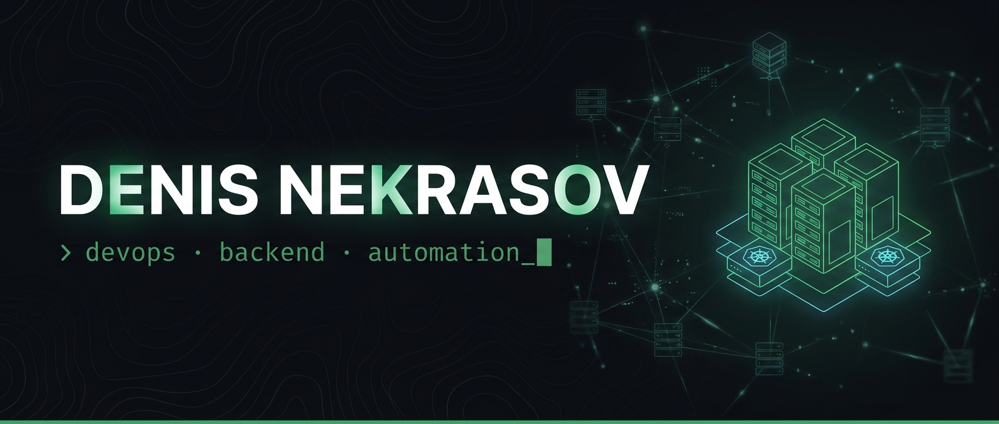

<div align="center">



<br/>

[](https://DenisNekrasov.dev)

<br/>

<a href="https://DenisNekrasov.dev"></a>
<a href="mailto:Denis@GNekrasov.ru"></a>
<a href="https://linkedin.com/in/denisnekrasov"></a>

<sub><a href="README.md">🇷🇺 Русский</a> &nbsp;·&nbsp; 🇬🇧 English</sub>

</div>

<br/>

## 💻 whoami

```bash
$ whoami
Denis Nekrasov — Senior IT Specialist · 10+ years in IT

$ cat mission.txt
Simple architectures · reproducible environments · metrics and SLO
I deliver solutions with measurable business impact

$ history | tail -3
  Head of IT: infrastructure from scratch, system modernization
  Bridge between IT and business: negotiations, vendors, processes
  Automating everything that can be automated_
```

- 🔭 Working on **scalable infrastructure solutions**
- 🌱 Deep-diving into **Kubernetes**, **Terraform** and **Cloud Native**
- 👯 Open to **collaboration** on open-source projects
- 💬 Always happy to discuss **DevOps**, **Backend** and **system architecture**
- 🌐 Projects and case studies at [**DenisNekrasov.dev**](https://DenisNekrasov.dev)

<br/>

## ⚙️ Tech Stack

<table>
<tr>
<td align="right"><b>Infrastructure<br/>& DevOps</b></td>
<td>


</td>
</tr>
<tr>
<td align="right"><b>Monitoring<br/>& Observability</b></td>
<td>


</td>
</tr>
<tr>
<td align="right"><b>Databases<br/>& brokers</b></td>
<td>


</td>
</tr>
<tr>
<td align="right"><b>Languages</b></td>
<td>


</td>
</tr>
<tr>
<td align="right"><b>Frontend</b></td>
<td>


</td>
</tr>
<tr>
<td align="right"><b>Integrations</b></td>
<td>


</td>
</tr>
</table>

<br/>

## 🏆 Key Achievements

> 🥇 **Global CIO contest winner** (together with Mikhail Kislenko) —
> [“Building a local IT landscape while separating from an international company”](https://globalcio.ru/projects/36374/)

- 🏗️ **IT infrastructure from scratch** for Rostovskaya Niva Group — port and linear grain elevators, mill, farm
- ⚙️ **Full-cycle automation of the Azov port grain elevator** — 1C rollout, automation down to the smallest details
- 🔄 **Elevator transition to a new management system** during ownership change — **with zero downtime**
- 🚀 **Separation from an international company** — independent IT landscape **in 3 months**
- 🚛 **Full-cycle grain truck traffic management system** — license plate recognition, automatic barriers, lab equipment integration

<br/>

## 🚀 What I Do

<table>
<tr>
<td width="33%" valign="top">

### 🏗️ Infrastructure

CI/CD pipelines (GitHub Actions, GitLab CI, Jenkins) · High Availability & Disaster Recovery · Blue-Green and Canary deployments · Infrastructure as Code (Terraform, Ansible)

</td>
<td width="33%" valign="top">

### 🌐 Full Stack

Microservices & RESTful APIs · React / Vue + TypeScript · Integrations (REST, GraphQL, Webhooks) · ETL & data migrations · Real-time (WebSockets, SSE)

</td>
<td width="33%" valign="top">

### 📊 Observability

Prometheus + Grafana dashboards · Centralized logging (ELK, Loki) · Distributed tracing (Jaeger, OpenTelemetry) · SLO/SLI & alerting

</td>
</tr>
</table>

<br/>

## 💼 Experience

<details>
<summary><b>🏢 Louis Dreyfus (Azov)</b> — administration and integration of enterprise IT systems</summary>
<br/>

- Optimization of loading/unloading and warehouse operations automation
- Ensuring uninterrupted operation of IT infrastructure
- Technical specifications, vendor management, user training
- Business process optimization
- 🏆 Global CIO contest winner — [project](https://globalcio.ru/projects/36374/)

</details>

<details>
<summary><b>🏢 JustDo-iT (Rostov-on-Don)</b> — business automation, 1C, system administration</summary>
<br/>

- Business automation, 1C systems
- System administration
- Development and support of [jdit.ru](https://jdit.ru)

</details>

<br/>

## 📊 GitHub

<div align="center">


<br/><br/>


<br/><br/>


<br/><br/>

<picture>
  <source media="(prefers-color-scheme: dark)" srcset="https://raw.githubusercontent.com/RoXyGeNOFF/RoXyGeNOFF/output/github-contribution-grid-snake-dark.svg"/>
  <source media="(prefers-color-scheme: light)" srcset="https://raw.githubusercontent.com/RoXyGeNOFF/RoXyGeNOFF/output/github-contribution-grid-snake.svg"/>
  
</picture>

</div>

<br/>

## 🎯 Focus

<div align="center">

| 🏗️ Architecture | 🔄 Automation | 📊 Observability | ⚡ Performance | 🔒 Security |
|:---:|:---:|:---:|:---:|:---:|
| Simple, scalable solutions | CI/CD, IaC | Metrics, logs, tracing | Optimization & scaling | Best practices |

</div>

<br/>

## 📬 Get in Touch

<div align="center">

<a href="https://DenisNekrasov.dev"></a>
<a href="mailto:Denis@GNekrasov.ru"></a>
<a href="https://linkedin.com/in/denisnekrasov"></a>

<br/><br/>

**💼 Open to new challenges and interesting projects!**

<sub>Support: [t.me/tribute](https://t.me/tribute/app?startapp=dxDq) &nbsp;·&nbsp; Thanks for visiting! ⭐</sub>

<br/><br/>


</div>
